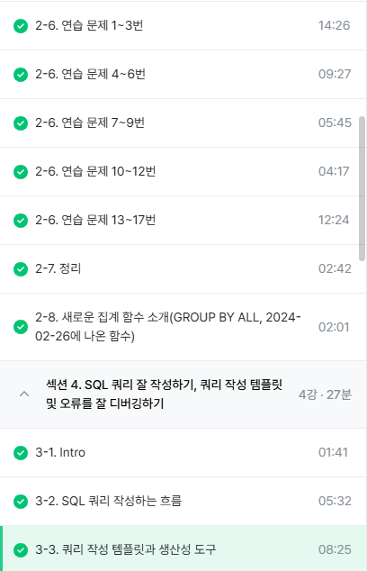

# 2주차
## 2-6. 연습문제 1~17번

```
<문제풀이 시 활용할 format>
테이블:
조건:
컬럼: 
집계: 
```

>**1번**
<br> - (힌트) ~가 없다: 컬럼 IS NULL
<br> - NULL: 아무것도 없는 값. 값이 존재하지 않을 때 NULL(NULL은 0 혹은 "&nbsp;"과도 다름. 값이 없는 상태)
<br> - NULL의 연산: 다른 값과 직접 비교할 수 없음. 따라서, IS 연산자를 사용함.
<br> - WHERE절에서 여러 조건을 연결하고 싶은 경우 -> AND 조건을 사용
<br> - OR 조건: (&ensp;) OR (&ensp;) 

>**2번**
<br> - 포켓몬 수를 집계해야 하므로 'COUNT'
<br> - 정렬 -> ORDER BY, 내림차순 ->DESC => ORDER BY 포켓몬 수 DESC
<br> - 빨간 밑줄: 에러 메시지(읽어보면서 해결 가능)
<br> - 집계 함수는 GROUP BY와 같이 다님. 집계하는 기준(컬럼)이 없으면 COUNT만 쓸 수 있으나, 집계하는 기준이 있다면 그 기준 컬럼을 GROUP BY에 써줘야 한다

>**3번**
<br> - '상관없이' 조건인가 아닌가?: 조건이 아님
<br> - 집계: 포켓몬 수 -> COUNT
<br> - DISTINCT: 고유한 값만 보고 싶을 때 사용한다.(다만, 여기서는 id를 설계할 때, 중복이 없게 설계했음. 그래서 DISTINCT의 유무에 상관없이 결과가 동일.)

>**4번**
<br> - 조건: 없음
<br> - 전설(is_legendary)
<br> - 컬럼의 이름 앞부분 일부를 입력하고 기다리면 자동 완성을 할 수 있는데, 이 때 찾아서 엔터하면 됨.
<br> - GROUP BY: 1, 2를 통해 직접 해당 컬럼의 입력하지 않고 순서를 언급함으로써 대체 가능(ORDER BY에도 적용 가능)

>**5번**
<br> - 조건: 같은 이름이 2개 이상(동명이인) => COUNT(name) => 2개 이상
<br> - 집계: COUNT
<br> - 집계 후 조건: HAVING, FROM절의 테이블 조건: WHERE
<br>&ensp; - WHERE: 원본 데이터 FROM절에 있는 데이터에 조건을 설정하고 싶은 경우
<br>&ensp; - HAVING: GROUP BY와 함께 집계 걸과에 조건을 설정하고 싶은 경우우

>**6번**
<br> - 조건: 트레이너의 이름 = "IRIS"
<br> - 컬럼: 정보 => 모든 컬럼
<br> - 집계: X

>**7번**
<br> - 조건: 이름 = "IRIS", "Whitney", "Cynthia" 중에 있으면 추출
<br> - 컬럼: 정보 -> *
<br> - 집계: 없음
<br> - OR을 쓰면 동명이인을 찾아낼 수 있음.
<br> - 힌트: OR조건으로 써서 코드가 길어져서 귀찮다면 => IN
<br> - IN: name에 괄호 안의 Value가 있는 Row만 추출

>**8번**
<br> - 오류: Unrecognized: Column 이름을 잘못 입력한 오류일 가능성이 큼

>**9번**
<br> - 컬럼: 세대(generation)
<br> - 집계: 포켓몬 수 => COUNT

>**10번**
<br> - 조건: type2가 존재하는! => type2 IS NOT NULL
<br> - 집계: 포켓몬의 수 => COUNT
<br> - 전체 116행 => COUNT(id)로 동일한가? 도 확인해보면 교차검증 가능

>**11번**
<br> - 조건: type2가 있는
<br> - 컬럼: type1
<br> - 집계: 제일 많은 => COUNT
<br> - 가장 많은 순서대로 알고 싶으면 ORDER BY 사용
<br> - LIMIT: 행 수를 제한

>**12번**
<br> - 조건: 단일 타입 => 하나의 타입만 존재 => type2가 NULL(값이 없어야 함)
<br> - 컬럼: type1
<br> - 집계: COUNT

>**13번**
<br> - 힌트: 컬럼 LIKE "파%" (컬럼 LIKE "특정단어%", 앞 뒤 모두 배치 가능능)
<br> - 조건: name에 "파"가 들어가는 포켓몬
<br> - 컬럼: 어떤 포켓몬이 있을까요? name
<br> - 집계: 없음

>**14번**
<br> - 조건: 뱃지가 6개 이상(badge_count >=6)
<br> - 컬럼: 없음
<br> - 트레이너의 수(COUNT)

>**15번**
<br> - 테이블: trainer_pokemon
<br> - 컬럼: trainer_id
<br> - 집계: 포켓몬의 수 => COUNT
<br> - DISTINCT를 사용하지 않은 이유: 한 트레이너가 여러 마리의 포켓몬을 가지고 있을 수 있으므로
<br> - 익숙하지 않을 때는 DISTINCT와의 결과가 동일한지 확인해보면 좋음

>**16번**
<br> - 테이블: trainer_pokemon
<br> - 조건: status = "Released" (풀어준)
<br> - 컬럼: trainer_id
<br> - 집계: 많이 풀어준 => COUNT
<br>&ensp; - 많이 풀어준 => ORDER BY + LIMIT

>**17번**
<br> - 힌트: COUNTIF(조건)
<br> - 테이블: trainer_pokemon
<br> - 조건: 풀어준 포켓몬의 비율이 20%가 높아야 한다.
<br> - 컬럼: trainer_id
<br> - 집계: COUNTIF
<br>&ensp; - COUNTIF(조건): COUNTIF(컬럼 = "3")

## 2-7. 정리


## 2-8. 새로운 집계 함수 소개
- GROUP BY ALL: 그룹화할 키를 inferring(추론)해줌. GROUP BY 1, 2, ...등을 작성하지 않아도 됨.

## 3-1. Intro
 - SQL 쿼리 작성하는 방법
 - 쿼리 작성 템플릿과 생산성 도구
 - 오류를 디버깅하는 방법

## 3-2. SQL 쿼리 작성하는 흐름
&nbsp;(1) 지표 고민: 어떤 문제를 해결하기 위해 데이터가 필요한가?(문제 정의)
<br>&nbsp;(2) 지표 구체화: 추상적이지 않고 구체적인 지표 명시(분자, 분모 명시)
<br>&nbsp;(3) 지표 탐색: 유사한 문제를 해결한 케이스가 있나 확인
<br>&ensp;(3-2) 없으면, 쿼리 작성: 데이터가 있는 테이블 찾기기
<br>&nbsp;&ensp;(3-2-1) 1개: 바로 활용
<br>&nbsp;&ensp;(3-2-2) 2개: 연결 방법 고민(JOIN)
<br>&nbsp;(4) 데이터 정합성 확인: 예상한 결과와 동일한지 확인(습관들이기)
<br>&nbsp;(5) 쿼리 가독성: 나중을 위해 깔끔하게 쿼리 작성

## 3-3. 쿼리 작성 템플릿과 생산성 도구
- 쿼리 작성 템플릿(이런 식으로 작성해 놓으면 쿼리 작성이 수월)
```
- 쿼리를 작성하는 목표, 확인할 지표:
- 쿼리 계산 방법:
- 데이터의 기간:
- 사용할 테이블:
- Join KEY
- 데이터 특징
```
```
SELECT

FROM
WHERE
```

- 템플릿 사용하는 것을 자꾸 까먹는다!
<br> - 개선하기 위해 생산성 도구를 활용
<br> - Espanso: 특정 단어를 입력하면 원하는 문장(템플릿)으로 변경
<br> 

## 수행 인증샷
