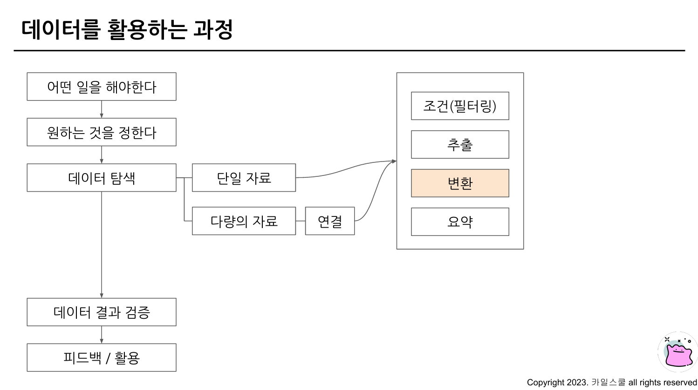
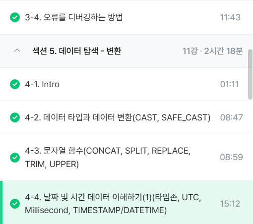

# 3주차
## 3-4. 오류를 디버깅하는 방법
* 오류 메시지가 알려주고자 하는 것
  * 현재 작성한 방식으로 하면 답을 얻을 수 없다는 길잡이 역할
  * 문제가 있는 부분을 지적해주는 문제 진단 역할

* 대표적인 오류: Syntax Error(문법 오류)
  * 문법을 지키지 않아 생기는 오류
  * Error Message를 보고 GhatGPT에 질문하여 해결 방법 찾아보기

* Syntax Error: SELECT list must not be empty at [10:1]
  * 번역: SELECT 목록은 [10:1]에서 비어 있으면 안 됩니다.
  * 아래에서 SELECT / FROM 사이의 col 위치가 비어있어서 생기는 오류
```
SELECT

FROM
WHERE
```
<br>

* Syntax Error: Number of arguemnts does not match for aggregate function COUNT
  * 번역: 집계 함수 COUNT의 인자 수가 일치하지 않습니다.
  * COUNT(kor_name, eng_name)의 인자 수 조건을 충족하지 않아서 생기는 오류인 듯.

* Syntax Error: SELECT list expression references column type 1 which is neither grouped nor aggregated
  * 번역: SELECT 목록 식은 다음에서 그룹화되거나 집계되지 않은 열을 참고합니다.
  * GROUP BY에 적절한 컬럼을 명시하지 않았을 경우 발생하는 오류

* Syntax Error: Expected end of input but got keyword SELECT
  * 번역: 입력이 끝날 것으로 예상되었지만 SELECT 키워드가 입력되었습니다.
  * 하나의 쿼리엔 SELECT가 1개만 있어야 함. 
  * SQLQuery를 여러 개 작성하고 싶을 때는 Query가 끝날 때 ;를 넣으면 됨.
  * ;는 Query가 끝났다는 것을 의미하는 기호임.
  Query가 끝나는 부분에 ;붙이고 실행할 부분만 드래그 앤 드랍해서 실행하기

* Syntax Error: Expected end of input but got keyword WHERE at [5:1]
  * 번역: 입력이 끝날 것으로 예상되었지만 [5:1]에서 키워드 WHERE을 얻었습니다.
  * LIMIT은 항상 맨 마지막 줄에 있어야 하는데, 그것이 WHERE 위에 위치했기 때문에 문제가 된 것.
  * 따라서, LIMIT을 맨 아래로 옮겨주거나 삭제하면 됨.

* Syntax Error: Expected ")" but got end of script at [8:11]
  * 번역:")"가 예상되지만 [8:11]에 스크립트가 끝났습니다.
  * 닫아주는 괄호가 없어서 발생한 것. 따라서 )를 입력해주면 됨.

## 4-1. INTRO: 이번 장에서 배울 내용
* 데이터 탐색: 변환
* 자료형(문자열, 날짜 및 시간 데이터)에 따른 여러 함수 소개
* 조건문 함수
* BigQuery 공식 문서 확인하는 방법

<br> 

## 4-2. 데이터 타입과 데이터 변환(CAST, SAFE_CAST)
* 변환을 위한 함수
  * SELECT 문에서 데이터를 변환시킬 수 있음.
  * WHERE의 조건문에도 사용할수 있으며, 데이터의 타입에 따라 다양한 함수가 존재한다.

<br> 

* 데이터의 타입: 예시
  * 숫자: 1, 2, 3, 3.14 ...
  * 시간, 날짜: 2024-01-01, 2024-01-01 23:59:10 ...
  * 부울(Bool): 참/거짓(WHERE 조건문은 TRUE만 가져오겠다는 것)

* 데이터 타입이 중요한 이유
  * 보이는 것과 저장된 것의 차이가 존재하기 때문
  * 예시
    * 엑셀에서 보았을 때 빈 값: ""일수도 있고, NULL일 수도 있음
    * 1이라고 작성된 경우: 숫자 1일수도 있고, 문자 1일수도 있음
    * 2023-12-31: DATE일수도 있고, 문자일수도 있음
  * 내 생각과 다른 경우 데이터의 타입을 서로 변환해야 함.

* 자료 타입을 변경하는 함수: CAST
  * 더 안전하게 데이터 타입 변경하려면면 SAFE_CAST 이용, SAFE가 붙은 함수는 변환이 실패할 경우 NULL 반환
```
SELECT
 CAST(1 AS STRING) #숫자 1을 문자 1로 변경
```

* 수학 함수
  * 수학 함수는 수학 연산(평균, 표준편차, 코사인 등)이 존재
  * 사용 빈도가 그리 높지 않으므로 외울 필요는 없을 듯.(필요할 때 찾기)
<br> 

## 4-3. 문자열 함수(CONCAT, SPLIT, REPLACE, TRIM, UPPER)
* 문자열 데이터로 할 수 있는 대표적인 연산
<br> 

* 문자열 붙이기: CONCAT
  * `CONCAT("안녕", "하세요") AS result`
  * `CONCAT(컬럼 1, 컬럼 2, ...`
  * CONCAT 인자로 STRING이나 숫자를 넣을 때에는 데이터를 직접 넣어준 것이므로, FROM이 없어도 실행 가능.

* 문자열 분리하기: SPLIT
  * `SPLIT("가, 나, 다, 라", ", ") AS result`
  * 쉼표가 제거된 채로 결과가 출력됨

* 특정 단어 수정하기: REPLACE
  * `REPLACE("안녕하세요", "안녕", "실천")`
  * `REPLACE(문자열 원본, 찾을 단어, 바꿀 단어)`

* 문자열 자르기: TRIM
  * `TRIM("안녕하세요", "하세요") AS reult`
  * `TRIME(문자열 원본, 자를 단어)`

* 영어 소문자를 대문자로 변경: UPPER
  * `UPPER("abc") AS result`
  * `UPPER(문자열 원본)`

## 4-4. 날짜 및 시간 데이터 이해하기(1)(타임존, UTC, Milisecond, TIMESTAMP/DATETIME)

<br>

* 날짜 및 시간 데이터의 핵심
  * created at: 언제 생성되었는가
  * updated at: 언제 변경되었는가
  * 유저가 어떤 행위를 했을 때마다 시간 기록이 남기 때문에, 시간 데이터는 항상 존재할 수밖에 없음.

* 시간 데이터의 종류
  * DATE: DATE만 표시하는 데이터
    * 2023-12-31
  * DATETIME: DATE + TIME
    * 2023-12-31 14:00:00
  * TIME: 날짜와 무관하게 시간만 표시하는 데이터
    * 23:59:59.00
  * TIMESTAMP: 시간 도장, UTC로부터 경과한 시간을 나타내는 값, TimeZone 정보 있음
    * 2023-12-31 14:00:00 UTC

* 시간 데이터 다루기 - 타임존
  * GMT: 영국 Greenwich Mean Time(한국시간: GMT +9)
  * UTC: Universal Time Coordinated(한국시간: UTC +9)
    * 국제적인 표준 시간, 최근에 많이 사용함
    * 타임존이 존재한다 = 특정 지역의 표준 시간대
    * GMT와는 거의 차이 나지 않으므로 신경쓸 정도는 아님.

* 시간 데이터 다루기 - milisecond, microsecond
  * milisecond: 천분의 1초(1,000ms = 1초)
    * 빠른 반응이 필요한 분야에서 사용함.
    * 활용 방법: Milisecond -> TIMESTAMP 변환, TIMESTAMP -> DATETIME으로 변경
      * 많은 회사들이 Tabel에 시간이 TIMESTAMP로 저장된 경우가 많음(혹은 DATETIME) -> 꼭 백엔드 개발자에게 물어보기
      * TIMESTAMP -> DATETIME 변환을 해야 할 수 있음.
  * microsecond: 1/1,000ms
  * 예시: 1704176819711ms -> 2024-01-02 15:26:59(DATETIME)
    * 주의사항: Datetime 쓸 때는 TIMEZONE을 누락하지 말자!
  <br>

* TIMESTAMP와 DATETIME의 비교
  * Timestamp(UTC): 한국시간 -9시간이므로, 한국 오전 09:00이면, UTC기준 0시임.
  * Datetime(T): 함수에 Asia/Seoul을 포함하므로 한국 시간과 동일하나, 다를 경우 Timezone을 확인해보아야 함.
<br>

## 수행 인증샷
