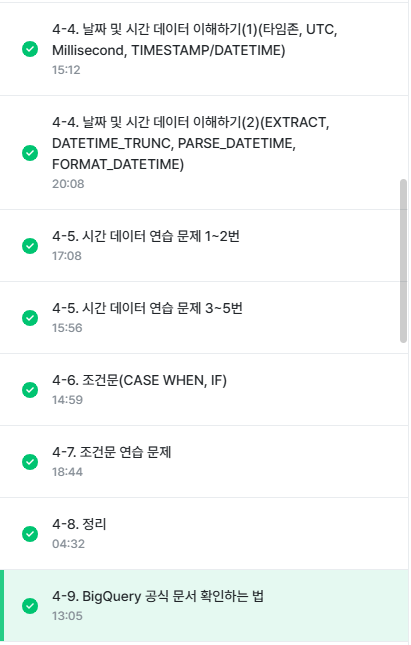

# 4주차
## 4-4. 날짜 및 시간 데이터 이해하기(2)(EXTRACT, DATETIME_TRUNC, PARSE_DATETIME, FORMAT_DATETIME)

* CURRENT_DATETIME([time_zone]): 현재 DATETIME 출력

* EXTRACT: DATETIME에서 특정 부분만 추출하고 싶은 경우
  * EXTRACT(part FROM datetime_expression)
<br> 
  * 요일을 추출하고 싶은 경우<br>: EXTRACT(DAYOFWEEK FROM datetime_col) <br>-> 한 주의 첫날이 일요일인 [1,7] 범위의 값을 반환

* DATE와 HOUR만 남기고 싶은 경우<br>: DATETIME_TRUNC(datetime_col, HOUR)

* 문자열로 저장된 DATETIME을 DATETIME 타입으로 바꾸고 싶은 경우<br>: PARSE_DATETIME('문자열의 형태', 'DATETIME 문자열') AS datetime

* DATETIME 타입 데이터를 특정 형태의 문자열 데이터로 변환하고 싶은 경우<br>: FORMAT_DATETIME<br>-> parse와 format으로 왔다갔다 가능

* 이외 DATETIME 함수
  * LAST_DAY(DATETIME): 마지막 날을 알고 싶은 경우
  * DATETIME_DIFF(첫 DATETIME, 두번째 DATETIME, 궁금한 차이): 두 DATETIME의 차이를 알고 싶은 경우

## 4-6. 조건문(CASE WHEN, IF)
* 조건문: 만약 특정 조건이 충족되면, 어떤 행동을 하자
  * 특정 조건이 참일때 A, 아니면 B<br>: 조건에 따른 분기 처리가 필요한 경우
  * 조건에 따라 다른 값을 표시하고 싶을 때 사용

* 조건문을 사용하는 방법
  * CASE WHEN
  * IF

* 조건문 함수가 사용되는 이유
  * 데이터 분석을 하다보면, 특정 카테고리를 하나로 합치는 전처리가 필요할 수 있음 
  * 이런 일이 발생하는 이유
    * 데이터를 저장하는 쪽과 분석하는 쪽이 나뉘고(팀 등으로)
    * 분석할 때 필요한 부분에서 조건 설정해서 변경하는 것이 더 유용함(저장할 때부터 특정 카테고리를 합쳐서 저장하면, 쪼개서 보고 싶을 때 볼 수 없음)<br>-> 저장할 때는 raw data급으로 저장하고, 활용할 때 조건문 걸어서 활용한다는 느낌
  * ex) 1~6학년으로 분류되어 있는 데이터를 조건문을 통해 저학년, 고학년으로 분류

* CASE WHEN: 여러 조건이 있을 경우 유용
  * 문법
  ```
  SELECT
   CASE
    WHEN 조건1 THEN 조건1이 참일 경우 결과
    WHEN 조건2 THEN 조건2가 참일 경우 결과
    ELSE 그 외 조건일 경우 결과
  END AS 새로운_칼럼_이름
  ```
  * **조건1, 조건2에 둘 다 해당**하면 **앞선 순서를 따름**
  * 문자열 함수(특정 단어 추출)에서 이슈가 자주 발생

* IF: 단일 조건일 경우 사용

## 4-8. 정리
* 컬럼 변환하기 정리(데이터 타입)
  * 숫자: 사칙연산, SAFE_DIVIDE
  * 문자: CONCAT, SPLIT, REPLACE, TRIM, UPPER
  * 시간, 날짜: EXTRACT, DATETIME_TRUNC, PARSE_DATETIME
  * 부울(Bool): TRUE/FALSE
  * 이외: 데이터 타입 변경하기, 조건문

## 4-9. BigQuery 공식 문서 확인하는 법
* 개발 공식 문서
  * 프로그래밍 언어, 라이브러리 등은 해당 기술을 어떻게 사용하면 좋은지에 대한 문서를 제공함(많이 참고하는 수학의 정석 느낌)
  * BigQuery에 해당되는 것은 아니고 대부분의 프로그래밍 관련 내용에 적용할 수 있음
  * 찾는 방법: "기술명+documentation"으로 검색
<br> ex) BigQuery Documentation 검색

* BigQuery 개발 공식 문서 찾아보기
  * BigQuery는 기능이 많고 발전이 오래된 제품이라 공식 문서에 자료가 많음
  * 만약 CONCAT 문법을 알고싶다면?
    1. BigQuery CONCAT document라고 구글에 검색
    1. 공식 문서에서 찾기(CTRL+F)를 사용해 문법쪽 확인
    1. 보통 예제 쿼리도 같이 제공함.

* 공식 문서를 꼭 봐야 하나?
  * 공식문서"도" 볼 수 있어야 함.
  * ChatGPT나 블로그 정보도 당연히 참고 가능하지만, 잘못된 자료이거나 과거 문법인 경우가 존재함.
  * 공식 문서는 구글에서 관리하는 수학의 정석같은 느낌이므로, 기준점으로 삼기에 바람직함.
  * 다만 공식 문서는 양이 방대하므로, 필요할 때 목적에 맞게 활용하는 것을 권장함.
  * BigQuery가 조용히 새로운 기능을 출시하기도 함. 이걸 빠르게 알기 위해서는?<br>-> RSS Feed 구독

  ## 수행 인증샷
